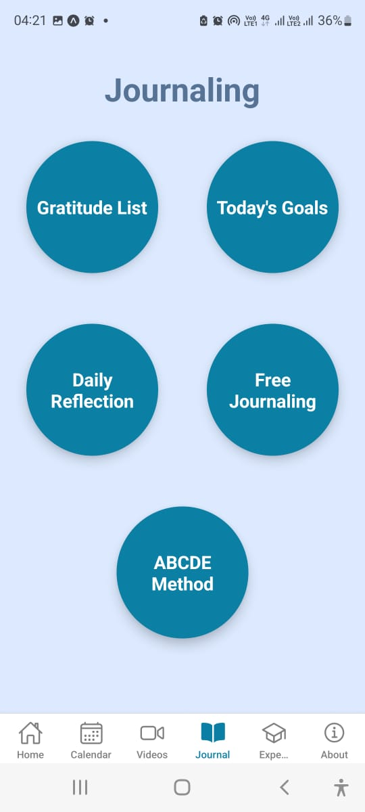

# Dear Me

Welcome to **Dear Me**, your personal journaling and habit-tracking companion. This app helps you maintain your daily reflections, track habits, practice gratitude, set goals, and much more to foster mindfulness and self-improvement.

## Get started

1. Install dependencies:

   ```bash
   npm install
   ```

2. Start the app:

   ```bash
   npx expo start
   ```

   In the output, you'll find options to open the app in a:

   - [Development build](https://docs.expo.dev/develop/development-builds/introduction/)
   - [Android emulator](https://docs.expo.dev/workflow/android-studio-emulator/)
   - [iOS simulator](https://docs.expo.dev/workflow/ios-simulator/)
   - [Expo Go](https://expo.dev/go), a limited sandbox for trying out app development with Expo

## Features

### Core Functionalities

- **Daily Reflection**: Record your thoughts and feelings about the day.
- **Free Journaling**: Write freely in your journal, reflecting on your experiences.
- **Habit Tracking**: Add, view, and manage your habits to stay consistent.
- **Gratitude Practice**: Save and revisit things you are grateful for.
- **Goals Management**: Set and track your goals for personal growth.
- **Meditation Support**: Access guided meditations to relax and focus.
- **Expert Advice**: Gain insights and tips to enhance your mindfulness journey.

### Additional Features

- View past journal entries in an organized layout.
- Save and revisit daily reflections.
- Learn more about the app on the **About** page.

## App Screenshots

Here are some screenshots of the app:

<div style="display: flex; flex-wrap: wrap; justify-content: flex-start;">
  
  
  
  
  
  
  
  
  
  
  
  
  
  
  
</div>

## Learn more

To learn more about developing your project with Expo, look at the following resources:

- [Expo documentation](https://docs.expo.dev/): Learn fundamentals, or go into advanced topics with our [guides](https://docs.expo.dev/guides).
- [Learn Expo tutorial](https://docs.expo.dev/tutorial/introduction/): Follow a step-by-step tutorial where you'll create a project that runs on Android, iOS, and the web.

## Join the community

Join our community of developers creating universal apps:

- [Expo on GitHub](https://github.com/expo/expo): View our open source platform and contribute.
- [Discord community](https://chat.expo.dev): Chat with Expo users and ask questions.
